# AutoHotkey v2 Dark Mode GUI Class

A self-contained dark mode GUI framework for AHK v2. One `#Include`, no external dependencies — `DarkGui()` is a drop-in replacement for `Gui()` that handles all the WinAPI custom drawing for you.

```autohotkey
#Include DarkModeModular_Fable.ahk

myGui := DarkGui("+Resize", "My App")
myGui.Add("Button", "+Accent", "OK")
myGui.Add("Edit", "w300", "text")
myGui.Show()
```

## Which file do I use?

Three generations of the framework, newest last. Pick the one matching your interpreter:

| File | Requires | Status |
|---|---|---|
| `DarkModeModular.ahk` | v2.1-alpha.17+ | Classic — for scripts on alpha.17 through alpha.28 |
| `DarkModeModular_Alpha.ahk` | v2.1-alpha.30 | Typed-Struct port — Win32 structs declared with typed `Struct` + class-ref properties (`IntPtr`, `Int32`, `UInt32`, ...), no hand-rolled offset math |
| `DarkModeModular_Fable.ahk` | v2.1-alpha.30 | **Current — use this for anything new** |

### What the Fable revision adds

- **Coverage** — DateTime, Hotkey, Tab/Tab2/Tab3, TreeView checkboxes, dark tooltips (`DarkToolTip`), dark Edit caret, generalized scrollbars.
- **Correctness** — `WM_SETTEXT` keeps Button/GroupBox captions in sync; native `AddButton`/`AddEdit`/... shorthands route through dark styling; menu-bar tooltips actually display; `MIM_BACKGROUND` uses the cached brush (no leak); radios expose their text to UIA.
- **Architecture** — handler registry (`DarkGui.Register`) so user control classes plug in without editing `Add()`; `DarkGui.Attach()` retrofits an existing plain `Gui`; subclassing via comctl32 `SetWindowSubclass`.
- **Theming** — `DarkTheme.SetPalette()` with presets (Default/OLED/Slate/Blue/Light) plus `OnThemeChanged` callbacks; palette swaps re-sync DWM title-bar colors and `Gui.BackColor` per window; `DarkTheme.FollowSystem()` tracks the OS light/dark setting; per-monitor DPI scaling via `GetDpiForWindow` with `WM_DPICHANGED` handling and a `DarkGui.OnDpiChanged()` hook.

Public API: `DarkGui`, `DarkTheme`, `DarkTitleBar`, `DarkMenu`, `DarkMenuBar`.

## Built with this system

Real GUIs from the wider script collection, each just `#Include`-ing one of the `DarkModeModular*` files:

Teleprompter — WPM-paced reading with strike-through for read words and live font/speed controls:

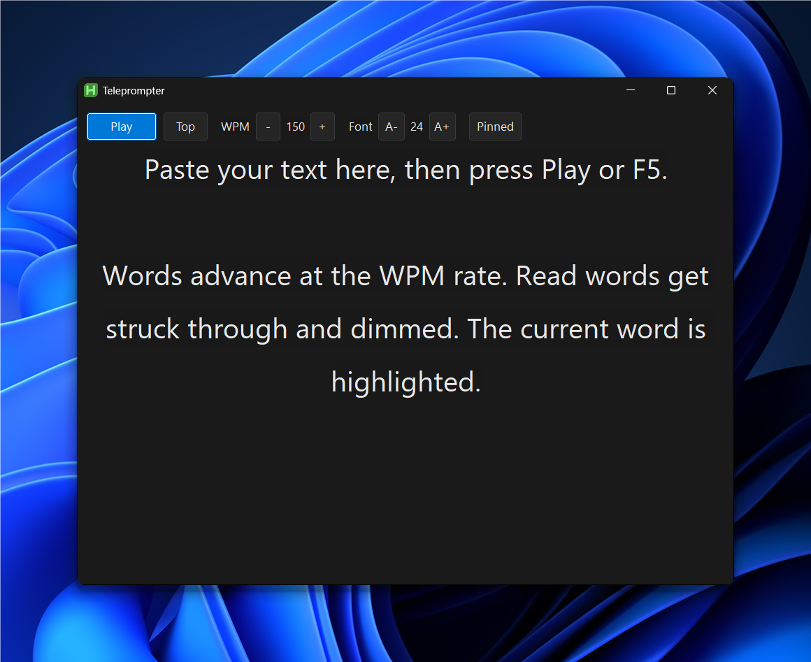

Pipeline Monitor — async pipeline visualizer with per-stage status boxes, timings, and live streamed output:

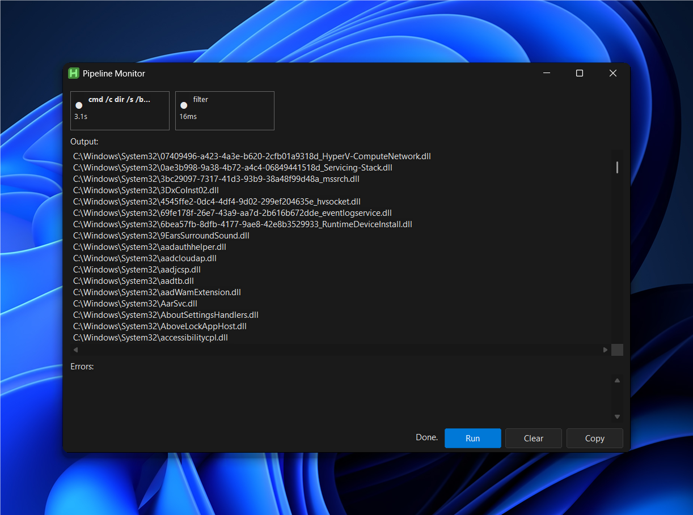

DarkPropertyGrid — editable property-grid custom control with category rows, in-place cell editors, and a change log:

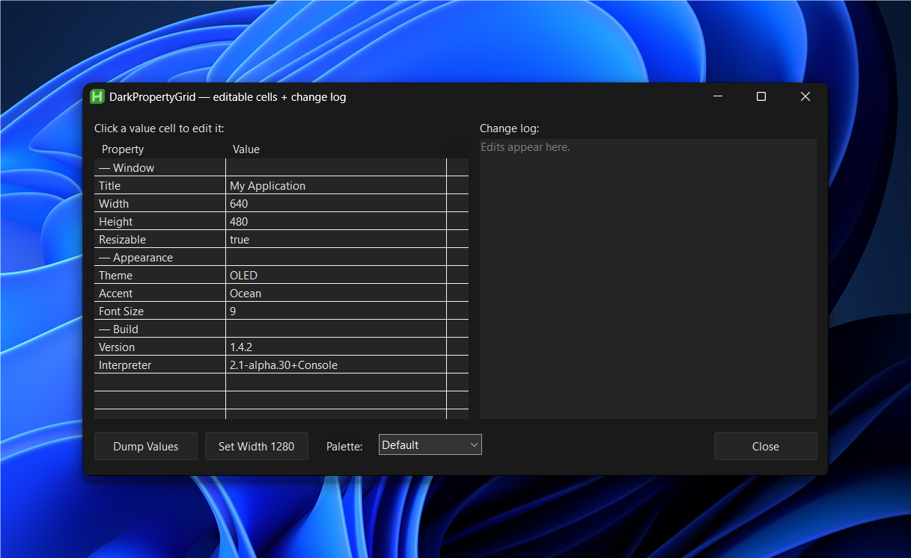

DarkRichEdit — themed RICHEDIT50W with named styles, per-run colors, and palette-swap re-theming:

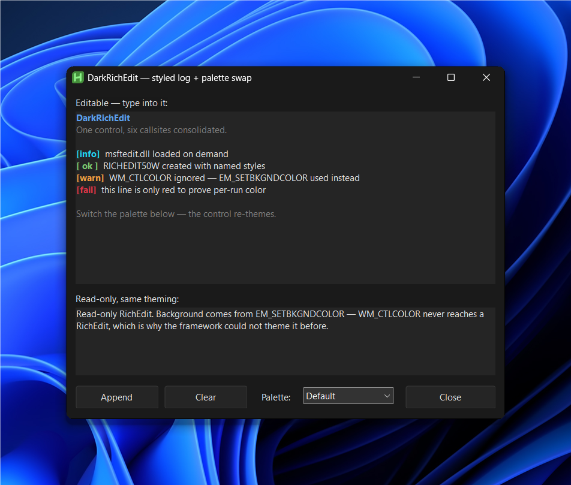

Advanced button styles — icon, split/dropdown, command-link, toggle, and flat buttons:

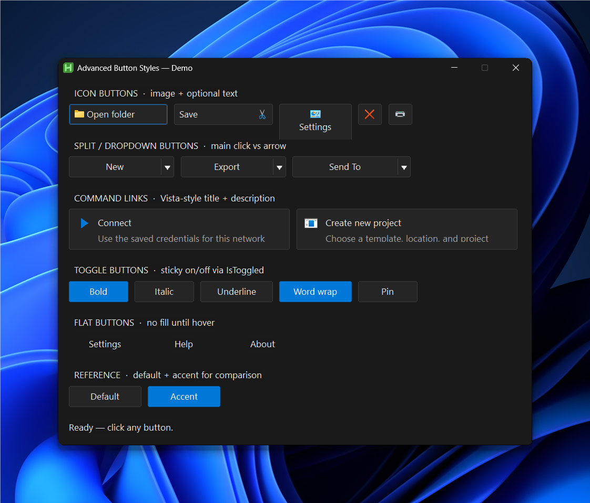

Search bar with an embedded flat button inside the Edit's border and a live-filtered list:

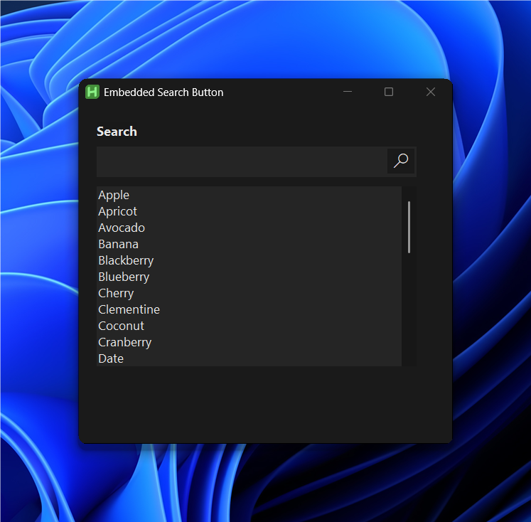

## Legacy experiments

`_Dark.ahk`, `_Dark2.ahk`, `__Darkest.ahk`, `___Darkest.ahk`, `Attempt_500.ahk`, `Draft.ahk`, and the `DarkGUI/` folder are earlier iterations kept for reference. They predate the modular rewrite — use the `DarkModeModular*` files instead.

## Screenshots

Each library ships with a built-in showcase — run the file directly (instead of `#Include`-ing it) to open a window exercising every supported control.

### Classic (`DarkModeModular.ahk`)

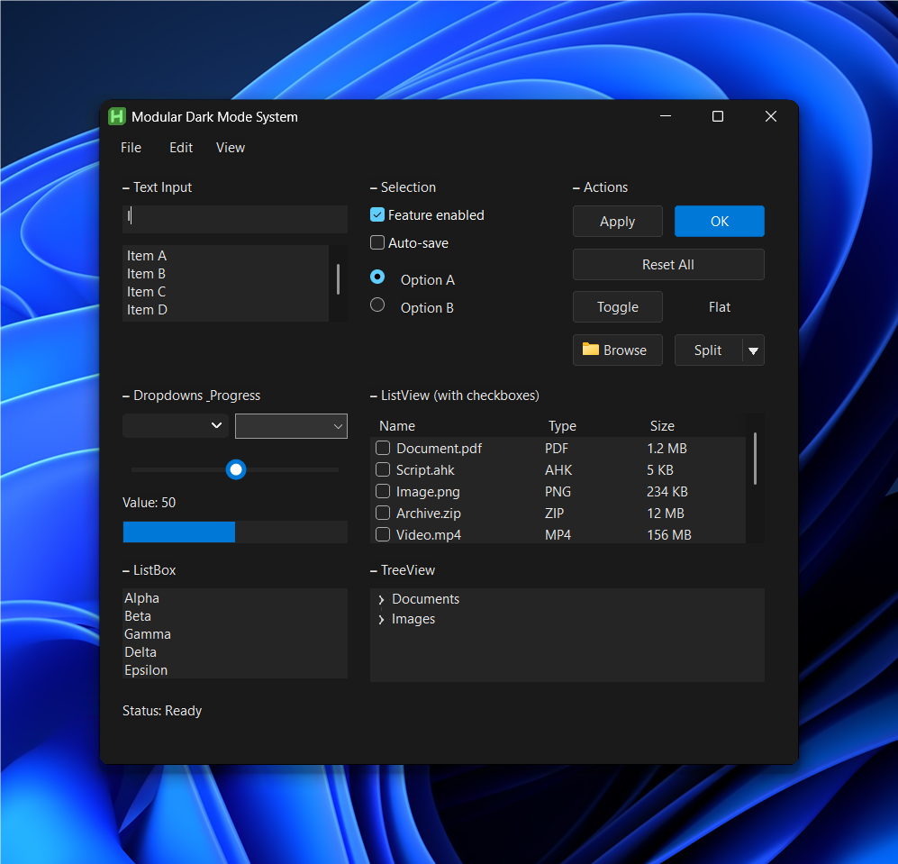

### Alpha port (`DarkModeModular_Alpha.ahk`)

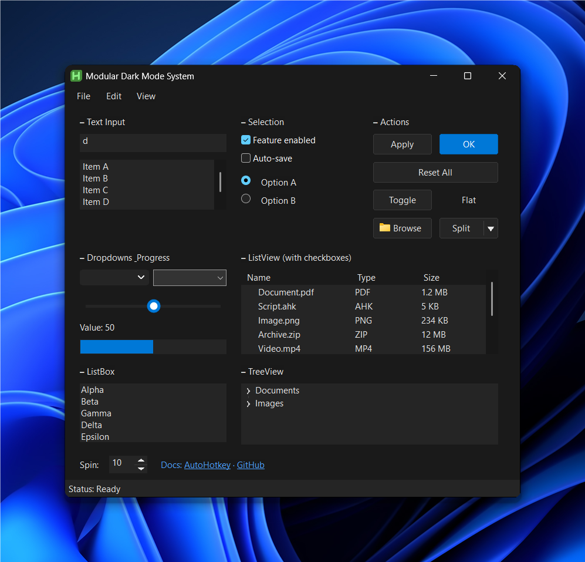

### Fable revision (`DarkModeModular_Fable.ahk`)

Default palette, with DateTime, Hotkey, Tab3, checkbox TreeView, and MonthCal coverage:

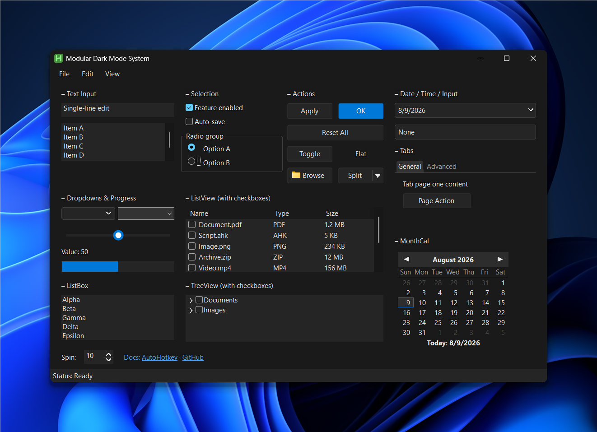

Live palette swap via `DarkTheme.SetPalette()` — OLED and Slate presets applied from the View menu:

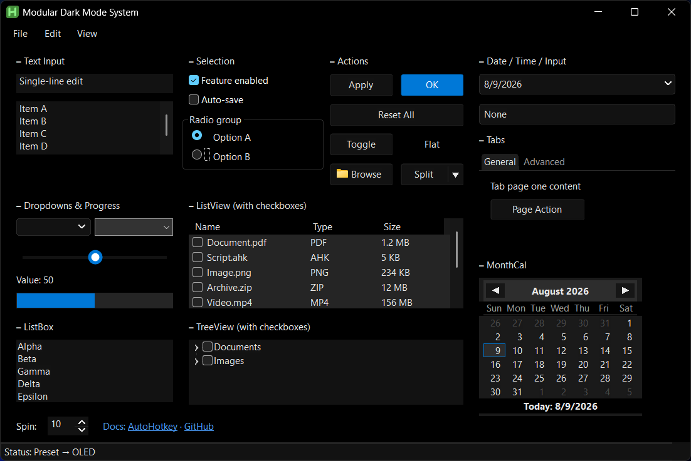

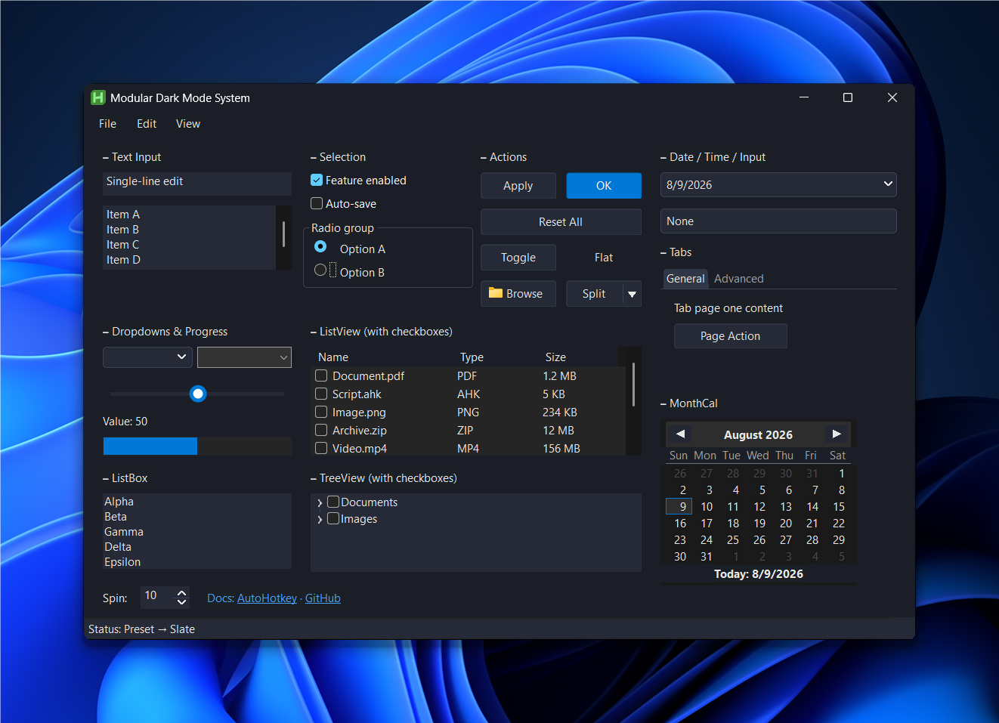

The Blue preset carries the accent hue into every surface — background, controls, borders, scrollbars — for windows that should read as blue rather than gray:

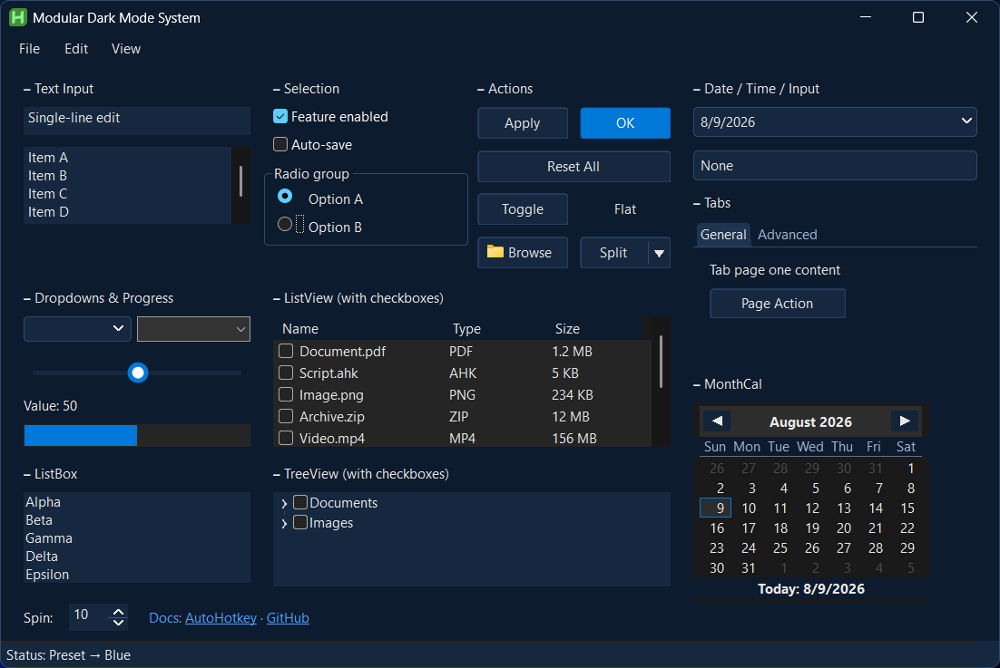

Screenshots are produced with `tools/compose.ps1`, which renders the target window off-screen via `PrintWindow`, then composites it onto the Windows 11 Bloom wallpaper with rounded corners and a drop shadow — no clean desktop required. `tools/capture.ps1` is the simpler live-screen variant.
