# AutoHotkey v2 Dark Mode GUI Class

A self-contained dark mode GUI framework for AHK v2. One `#Include`, no external dependencies, and one line to turn a whole script dark.

## One line

Add `DarkGui.Global()` after the include. Every `Gui()` constructed after it, including `class X extends Gui` and windows that other libraries create, is attached with all of its controls, and `MsgBox`/`InputBox` come out dark too. Nothing else in the script changes.

```autohotkey
#Include DarkModeModular.ahk
DarkGui.Global()

; ...the rest of your script, written the ordinary way
app := Gui("+Resize", "One line")
app.Add("Edit", "x140 y16 w260 h26", "Quarterly report")
app.Add("DropDownList", "x140 y52 w260 Choose1", ["Alex", "Sam", "Jordan"])
app.Add("CheckBox", "x140 y88 w260 +Checked", "Send a reminder")
app.Add("ListView", "x16 y122 w384 h120", ["Task", "Status"])
app.Show()
```

The same script, `examples/00_OneLine.ahk`, without and with that one line:

| Without `DarkGui.Global()` | With `DarkGui.Global()` |
|---|---|
| 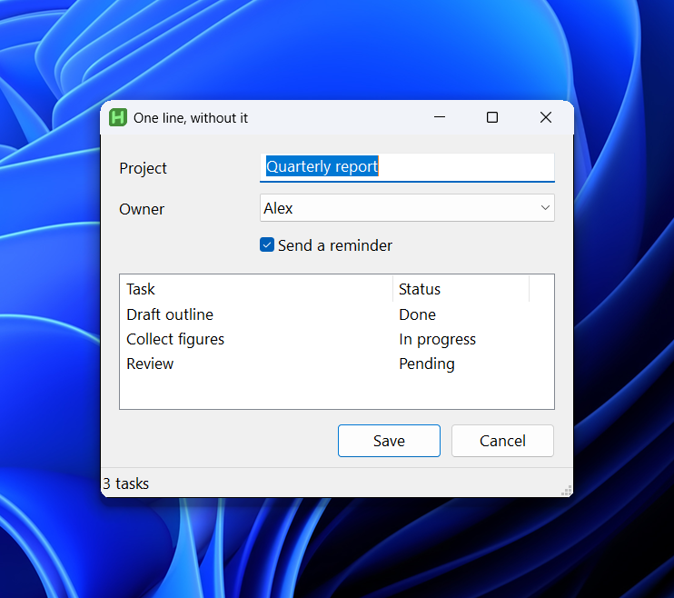 | 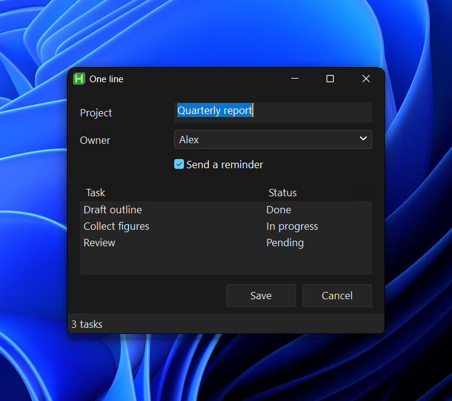 |

If you would rather opt in per window, `DarkGui()` is a drop-in replacement for `Gui()`, and `DarkGui.Attach(existingGui)` themes a window you already have:

```autohotkey
#Include DarkModeModular.ahk

myGui := DarkGui("+Resize", "My App")
myGui.Add("Button", "+Accent", "OK")
myGui.Add("Edit", "w300", "text")
myGui.Show()
```

## Which file do I use?

| File | Requires | Role |
|---|---|---|
| `DarkModeModular.ahk` | v2.1-alpha.30 | **Main. Use this.** The polished, gated build. |
| `DarkModeModular_Alpha.ahk` | v2.1-alpha.30 | Experimental. New features land here first and are promoted to the main file once the test gates pass. Same API, may carry unfinished work. |
| `DarkModeModular_Classic.ahk` | v2.1-alpha.17 to .28 | Frozen older generation for interpreters before alpha.30 (hand-rolled struct offsets, smaller control coverage). |
| `DarkModeModular_Fable.ahk` | v2.1-alpha.30 | Compatibility shim that includes the main file, so existing `#Include DarkModeModular_Fable.ahk` lines keep working. |

Never include two of these in one script. They declare the same classes.

## What the main build does

- **Coverage.** Button (icon, split, command-link, toggle and flat variants), Edit (dark caret, cue banners), ComboBox and DDL, ListBox, ListView (custom-draw rows, groups, header, checkboxes), TreeView (checkboxes), Tab/Tab2/Tab3, GroupBox, CheckBox and Radio, Slider, Progress (states and marquee), UpDown, DateTime, MonthCal, Hotkey, Link, StatusBar, menu bar and popup menus, tooltips, scrollbars, and opt-in dark MsgBox/InputBox via `DarkDialogs.Install()`.
- **Architecture.** One handler registry (`DarkGui.Handlers`). `DarkGui.Register(type, handler)` plugs user control classes in without editing `Add()`. Subclassing goes through comctl32 `SetWindowSubclass` and reclaims thunks and owner state on `WM_NCDESTROY`; parent-side messages (`WM_CTLCOLOR*`, `WM_NOTIFY`, `WM_DRAWITEM`) dispatch through an hwnd-keyed child registry.
- **Options.** `+Accent`, `+Flat`, `+Toggle[=on]`, `+Icon=<spec> [+Align=..]` on buttons; `c<X>` / `Background<X>` accept a hex value, an AHK colour name or a `DarkTheme.Colors` key that follows palette swaps.
- **Theming.** `DarkTheme.SetPalette()` with presets (Default, OLED, Slate, Blue, Light) and `OnThemeChanged` callbacks. Palette swaps re-sync DWM title-bar colors and `Gui.BackColor` per window. `DarkTheme.FollowSystem()` tracks the OS light/dark setting. Per-monitor DPI via `GetDpiForWindow` and `WM_DPICHANGED` with a `DarkGui.OnDpiChanged()` hook. High-contrast mode stands the theme down automatically.
- **Typed-Struct foundation.** Win32 structs are declared with the alpha.30 `Struct` keyword and class-ref properties (`IntPtr`, `Int32`, `UInt32`, ...); no hand-rolled offset math.

Public API: `DarkGui`, `DarkTheme`, `DarkTitleBar`, `DarkMenu`, `DarkMenuBar`, `DarkScrollbar`, `DarkToolTip`, `DarkDialogs`.

## Showcase

The library has no auto-execute section. Run `Showcase.ahk` for a window that exercises every supported control, the button variants, the palette presets (View menu) and the dark dialogs.

## Examples

Each file in `examples/` is a short, self-contained script that shows one part of the library. Run any of them directly.

### 00 · One line

`examples/00_OneLine.ahk`. The before/after pair at the top of this page. An ordinary script with `DarkGui.Global()` as its only dark-mode line.

### 01 · Hello, dark

`examples/01_HelloDark.ahk`. The smallest dark window: `DarkGui()` in place of `Gui()`, a cue banner, an accent button, a status bar.

```autohotkey
app := DarkGui("+Resize", "Hello, dark")
name := app.Add("Edit", "x16 y44 w320 h26")
name.SetCue("Type your name")
app.Add("Button", "+Accent x16 y116 w100 h30", "Say hello")
```

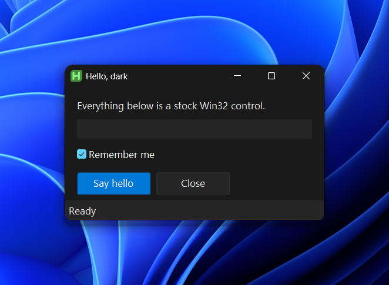

### 02 · Global one-liner

`examples/02_GlobalOneLiner.ahk`. A plain `Gui()`, a `class SettingsWindow extends Gui`, and a dark `InputBox`/`MsgBox`. None of them mention dark mode.

```autohotkey
DarkGui.Global()

main := Gui("+Resize", "Global: plain Gui()")

class SettingsWindow extends Gui {
    __New() {
        super.__New("+Owner", "Global: class extends Gui")
        this.Add("CheckBox", "x24 y34 w250 +Checked", "Launch at sign-in")
    }
}
```

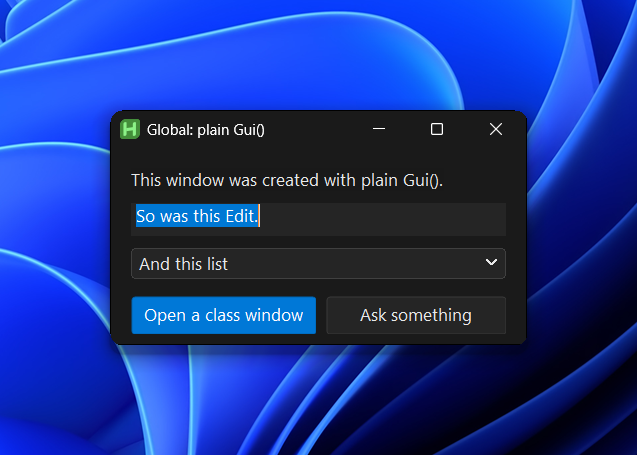

### 03 · Attach an existing Gui

`examples/03_AttachExisting.ahk`. The window is built first, controls and all. `DarkGui.Attach(win)` themes it in place and keeps styling whatever is added afterwards; `DarkGui.Detach(win)` hands it back.

```autohotkey
win := Gui("+Resize", "Attach / Detach")
win.Add("Edit", "x16 y44 w300 h26", "Edit created before Attach")

DarkGui.Attach(win)
win.Add("CheckBox", "x16 y262 w300 +Checked", "Added after Attach, still dark")
```

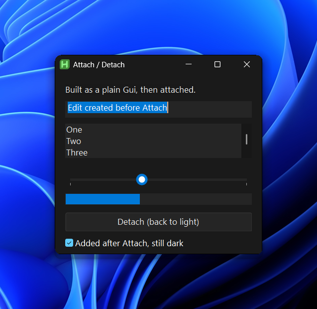

### 04 · Palettes

`examples/04_Palettes.ahk`. The five presets, a custom `SetPalette`, `FollowSystem`, an `OnThemeChanged` readout, a palette key of your own via `DefineColor`, and palette keys used as colour words in options.

```autohotkey
DarkTheme.DefineColor("Brand", 0xE07A5F, 0xB5533A)
app.Add("Text", "x28 y148 w280 cAccent", "This text uses the Accent key")
app.Add("Text", "x28 y192 w280 cBrand", "This text uses the Brand key defined above")

DarkTheme.ApplyPreset("OLED")
DarkTheme.OnThemeChanged(UpdateReadout)
DarkTheme.FollowSystem(OnSystemTheme)
```

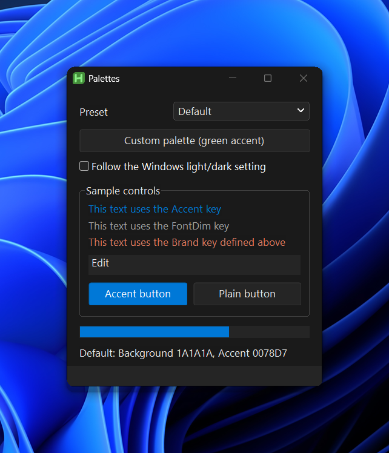

### 05 · Buttons

`examples/05_Buttons.ahk`. Every button style, once through the option grammar on a plain `Add("Button")` and once through the factories.

```autohotkey
app.Add("Button", "+Accent x176 y36 w150 h30", "+Accent")
app.Add("Button", "+Toggle=on x176 y74 w150 h30", "+Toggle=on")
app.Add("Button", "+Icon=shell32.dll,4 +Align=right x176 y112 w150 h30", "+Align=right")

app.AddSplitButton("x176 y182 w150 h30", "Save", splitMenu)
app.AddCommandLink("x16 y258 w310 h60", "Command link", "A title plus a description line")
```

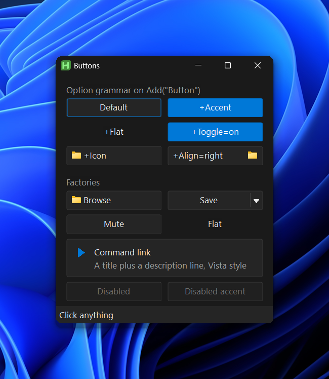

### 06 · Lists

`examples/06_Lists.ahk`. ListView with checkboxes and click-to-sort columns, TreeView with checkboxes, a ListBox with an owner-drawn `DarkScrollbar` rail, and a search box that filters the ListView as you type.

```autohotkey
lv := app.Add("ListView", "x16 y50 w360 h170 +Checked -Multi", ["Name", "Type", "Size (KB)"])
tv := app.Add("TreeView", "x392 y50 w200 h170 Checked")
lb := app.Add("ListBox", "x16 y254 w360 h96", items)
rail := DarkScrollbar(app, lb)
```

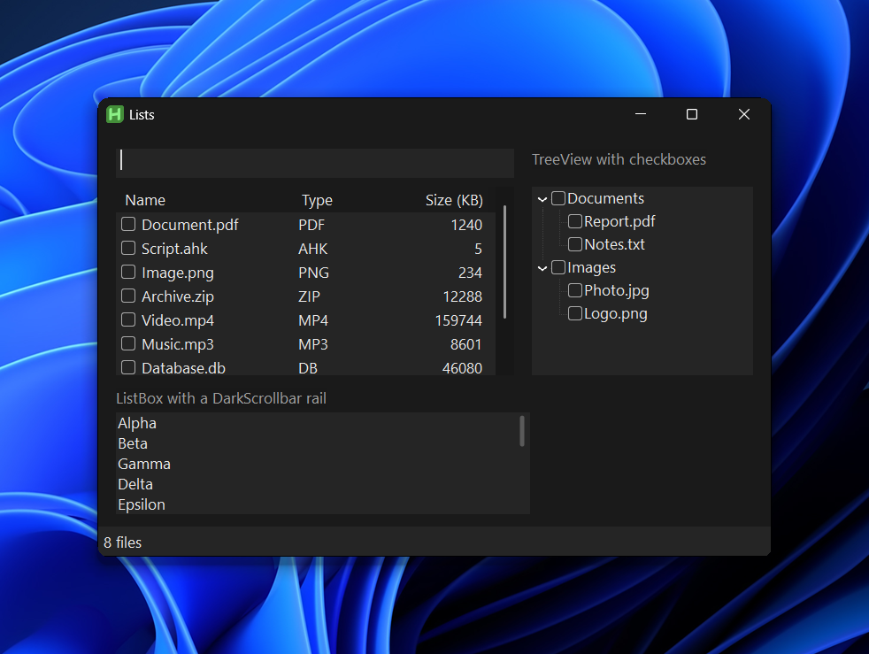

### 07 · Settings form

`examples/07_SettingsForm.ahk`. A three-page `Tab3` form with every input control, disabled-state colours, and a Progress bar that cycles through its state colours.

```autohotkey
tab := app.Add("Tab3", "x16 y16 w400 h300", ["General", "Schedule", "Advanced"])
region.SetCue("Pick or type a region")
prog.SetState("error")
prog.SetMarquee(true)
```

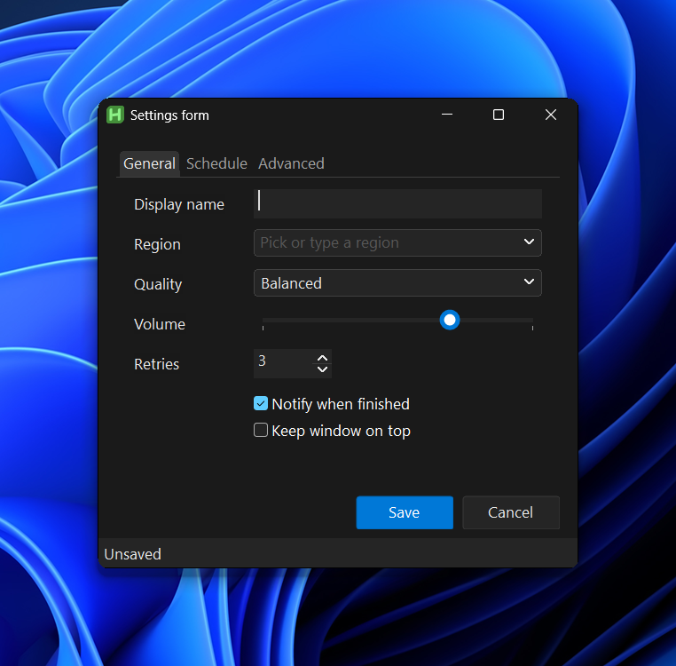

### 08 · Menu bar and toolbar

`examples/08_MenuBarToolbar.ahk`. `DarkMenuBar` with popup menus and an icon toolbar row, `WM_COMMAND` routing, a multi-part status bar, dark dialogs and a `DarkToolTip.Show` tip.

```autohotkey
bar := DarkMenuBar(app, opts)
file := bar.AddMenu("File")
file.Item("New", CMD_NEW, "Ctrl+N")
bar.AddToolbarButton("+", "New (Ctrl+N)", (*) => (Command(CMD_NEW), 0))
OnMessage(0x0111, OnCommand)
```

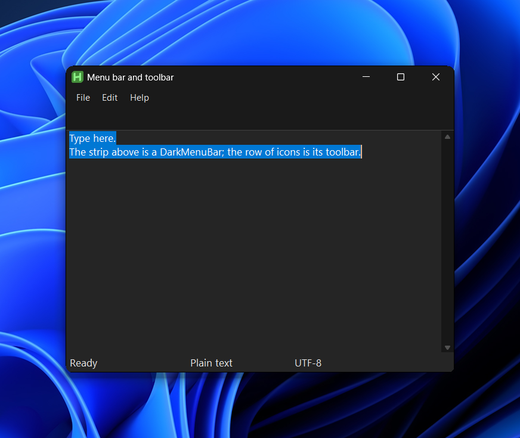

### 09 · Custom control handler

`examples/09_CustomControl.ahk`. `DarkGui.Register` with a handler for a control the library does not know, the comctl32 IP-address control, using the same `Subclass`, `CtlColorReply` and palette brushes the built-ins use.

```autohotkey
class DarkIPAddress {
    static Apply(owner, ctrl, options := "", content?) {
        Subclass.InstallProc(this, ctrl.Hwnd, "Proc")
    }
    static Proc(targetHwnd, hwnd, msg, wParam, lParam) {
        if msg = 0x0133   ; WM_CTLCOLOREDIT from the field Edits
            return DarkWindowProc.CtlColorReply(wParam, "Font", "Controls")
        return Subclass.Forward(hwnd, msg, wParam, lParam)
    }
}
DarkGui.Register("Custom", DarkIPAddress, "SysIPAddress32")
ip := app.Add("Custom", "ClassSysIPAddress32 x16 y44 w220 h26")
```

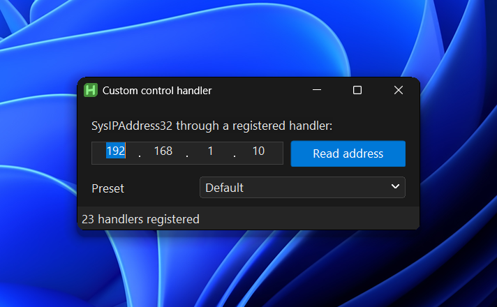

## Built with this system

Real GUIs from the wider script collection, each just `#Include`-ing `DarkModeModular.ahk`:

Teleprompter, WPM-paced reading with strike-through for read words and live font/speed controls:


Pipeline Monitor, an async pipeline visualizer with per-stage status boxes, timings, and live streamed output:


DarkPropertyGrid, an editable property-grid custom control with category rows, in-place cell editors, and a change log:


DarkRichEdit, a themed RICHEDIT50W with named styles, per-run colors, and palette-swap re-theming:


Advanced button styles: icon, split/dropdown, command-link, toggle, and flat buttons:


Search bar with an embedded flat button inside the Edit's border and a live-filtered list:


## Palette presets

The showcase under each preset. Default, with DateTime, Hotkey, Tab3, checkbox TreeView, and MonthCal coverage:


OLED and Slate, applied live via `DarkTheme.SetPalette()` from the View menu:

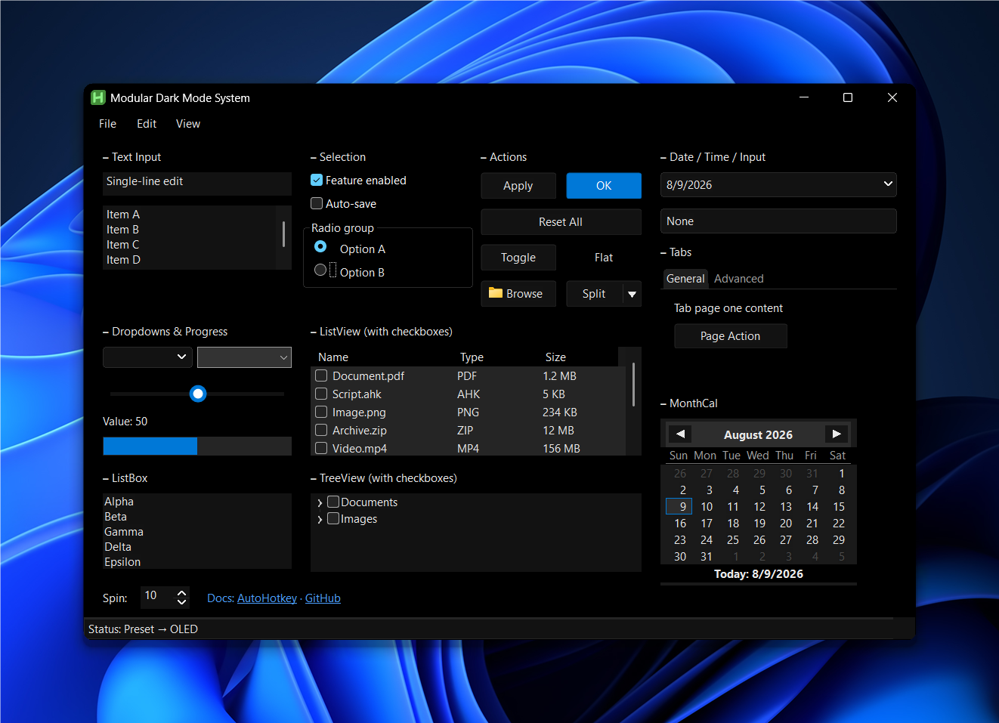


Blue carries the accent hue into every surface, background, controls, borders and scrollbars, for windows that should read as blue rather than gray:

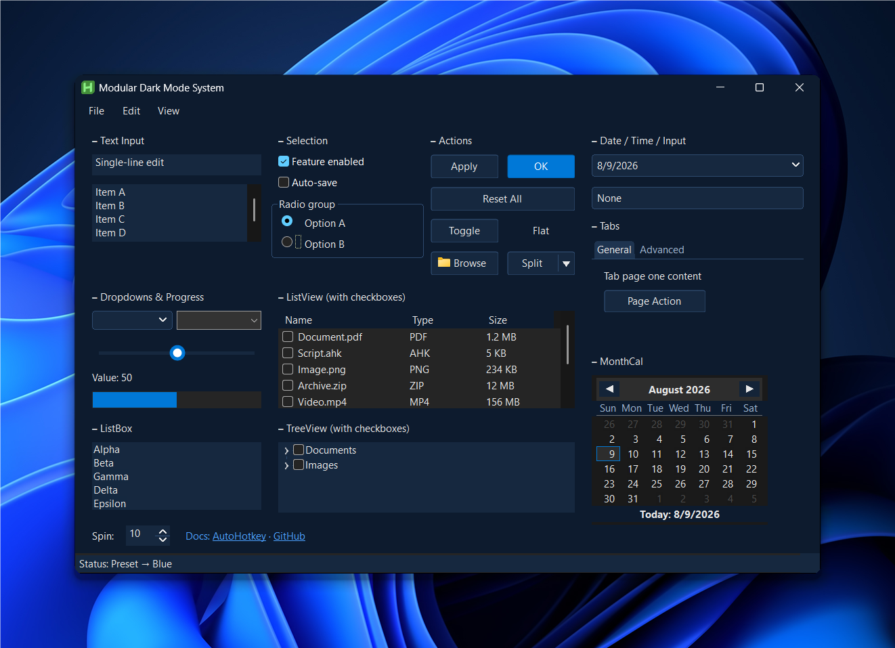

The classic library (`DarkModeModular_Classic.ahk`) for comparison:


Screenshots are produced with `tools/compose.ps1`, which renders the target window off-screen via `PrintWindow`, then composites it onto the Windows 11 Bloom wallpaper with rounded corners and a drop shadow. `tools/capture.ps1` is the simpler live-screen variant.
