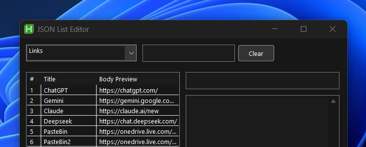
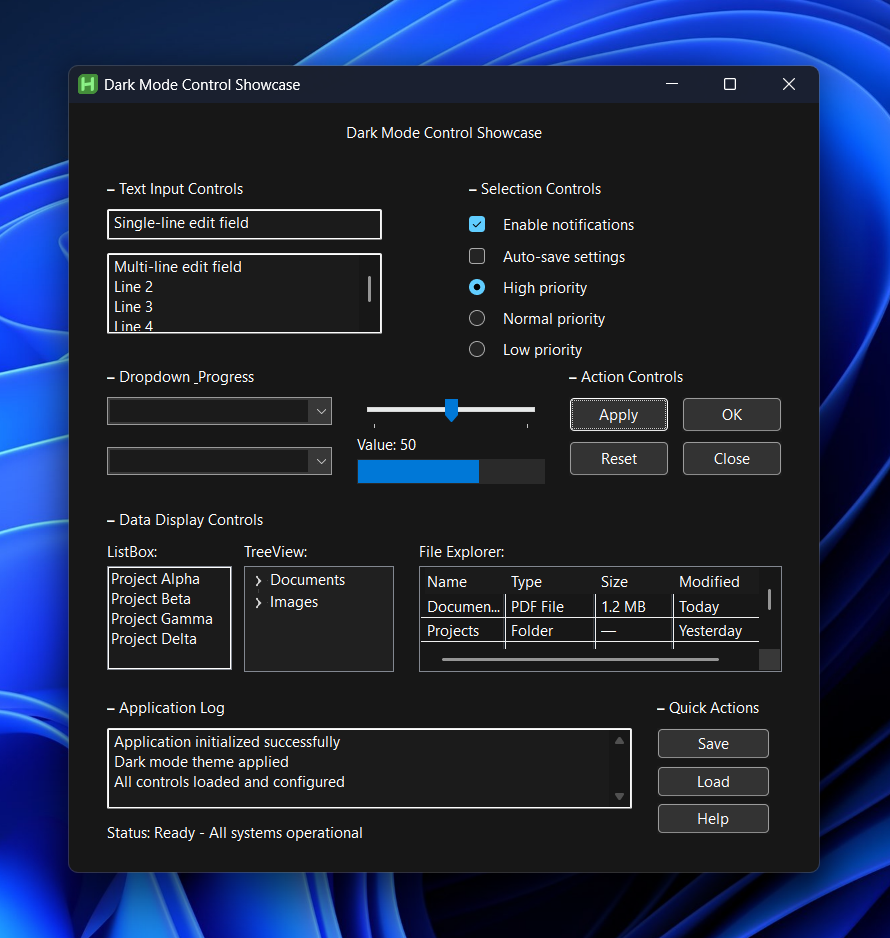

# AutoHotkey v2 Dark Mode GUI Class

A self-contained dark mode GUI framework for AHK v2. One `#Include`, no external dependencies — `DarkGui()` is a drop-in replacement for `Gui()` that handles all the WinAPI custom drawing for you.

```autohotkey
#Include DarkModeModular_Fable.ahk

myGui := DarkGui("+Resize", "My App")
myGui.Add("Button", "+Accent", "OK")
myGui.Add("Edit", "w300", "text")
myGui.Show()
```

## Which file do I use?

Three generations of the framework, newest last. Pick the one matching your interpreter:

| File | Requires | Status |
|---|---|---|
| `DarkModeModular.ahk` | v2.1-alpha.17+ | Classic — for scripts on alpha.17 through alpha.28 |
| `DarkModeModular_Alpha.ahk` | v2.1-alpha.30 | Typed-Struct port — Win32 structs declared with typed `Struct` + class-ref properties (`IntPtr`, `Int32`, `UInt32`, ...), no hand-rolled offset math |
| `DarkModeModular_Fable.ahk` | v2.1-alpha.30 | **Current — use this for anything new** |

### What the Fable revision adds

- **Coverage** — DateTime, Hotkey, Tab/Tab2/Tab3, TreeView checkboxes, dark tooltips (`DarkToolTip`), dark Edit caret, generalized scrollbars.
- **Correctness** — `WM_SETTEXT` keeps Button/GroupBox captions in sync; native `AddButton`/`AddEdit`/... shorthands route through dark styling; menu-bar tooltips actually display; `MIM_BACKGROUND` uses the cached brush (no leak); radios expose their text to UIA.
- **Architecture** — handler registry (`DarkGui.Register`) so user control classes plug in without editing `Add()`; `DarkGui.Attach()` retrofits an existing plain `Gui`; subclassing via comctl32 `SetWindowSubclass`.
- **Theming** — `DarkTheme.SetPalette()` with presets (Default/OLED/Slate/Light) plus `OnThemeChanged` callbacks; palette swaps re-sync DWM title-bar colors and `Gui.BackColor` per window; `DarkTheme.FollowSystem()` tracks the OS light/dark setting; per-monitor DPI scaling via `GetDpiForWindow` with `WM_DPICHANGED` handling and a `DarkGui.OnDpiChanged()` hook.

Public API: `DarkGui`, `DarkTheme`, `DarkTitleBar`, `DarkMenu`, `DarkMenuBar`.

## Legacy experiments

`_Dark.ahk`, `_Dark2.ahk`, `__Darkest.ahk`, `___Darkest.ahk`, `Attempt_500.ahk`, `Draft.ahk`, and the `DarkGUI/` folder are earlier iterations kept for reference. They predate the modular rewrite — use the `DarkModeModular*` files instead.

## Screenshots




